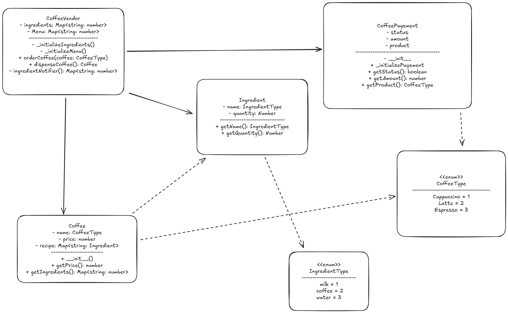

# Solution

I have used the Singleton design pattern in making the CoffeeVendor class. Here is a UML Class diagram to ease your understanding of the solution.

> you can drag and drop this image in excalidraw to view and edit the diagram.

The meaning of different arrows can be understood from the below diagram

